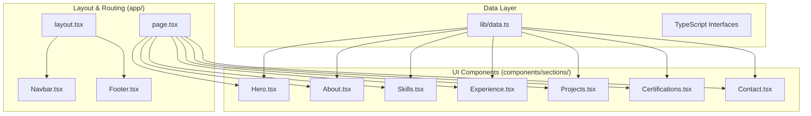

# Veekshith Gullapudi - Personal Portfolio

A modern, responsive, and performance-optimized personal portfolio builder using **Next.js 14**, **React**, **TypeScript**, and **Tailwind CSS**. This project showcases professional experience, skills, and projects with a clean, animated interface.

## 🚀 Features

- **Responsive Design**: Fully responsive layout optimized for mobile, tablet, and desktop.
- **Dynamic Content**: Centralized data management via `lib/data.ts` for easy updates.
- **Smooth Animations**: powered by `framer-motion` for engaging entrance and scroll effects.
- **Dark Mode**: Integrated theme switching (light/dark/system).
- **SEO Optimized**: Server-side rendered content for better search engine visibility.

## 🛠 Tech Stack

- **Framework**: [Next.js 14](https://nextjs.org/) (App Router)
- **Language**: [TypeScript](https://www.typescriptlang.org/)
- **Styling**: [Tailwind CSS](https://tailwindcss.com/)
- **Icons**: [Lucide React](https://lucide.dev/)
- **Animations**: [Framer Motion](https://www.framer.com/motion/)

## 🏗 Architecture

The application follows a modular, component-based architecture. Data is decoupled from UI components to simplify maintenance.



## 🏁 Getting Started

### Prerequisites

- **Node.js**: v18.17.0 or higher
- **npm**: v9.0.0 or higher

### Installation

1.  Clone the repository:
    ```bash
    git clone https://github.com/veekshith/portfolio.git
    cd portfolio
    ```

2.  Install dependencies:
    ```bash
    npm install
    ```

### Running Locally

Start the development server:
```bash
npm run dev
```

Open [http://localhost:3000](http://localhost:3000) in your browser.

### Building for Production

Create an optimized build:
```bash
npm run build
```

Start the production server:
```bash
npm start
```


## 🚀 Deploying to GitHub Pages

This project is configured for automated deployment to GitHub Pages using GitHub Actions.

### Setup Instructions

1.  **Push to GitHub**: Ensure your code is pushed to a GitHub repository.
2.  **Configure Repository Settings**:
    -   Go to your repository on GitHub.
    -   Navigate to **Settings** -> **Pages**.
    -   Under **Build and deployment** > **Source**, select **GitHub Actions**.
    -   (Optional) If using a custom domain, configure it here.
3.  **Trigger Deployment**:
    -   The deployment workflow runs automatically on every push to the `main` branch.
    -   You can verify the progress in the **Actions** tab of your repository.

### Configuration Notes

-   **Static Export**: The project uses `output: 'export'` in `next.config.ts` to generate a static site.
-   **Images**: `images: { unoptimized: true }` is enabled since GitHub Pages doesn't support Next.js Image Optimization.

## 🔮 Future Enhancements (Backend Integration)

To handle dynamic form submissions and content management without code changes, the following backend architecture is planned:

```mermaid
flowchart LR
    Client[Next.js Frontend] <--> API[FastAPI / Express Backend]
    API <--> DB[(PostgreSQL / MongoDB)]
    API --> Email[Email Service (resend/AWS SES)]
    API --> LLM[Gemini API (Resume Generator)]

    subgraph "Backend Services"
        Logic[Business Logic]
        Auth[Authentication]
    end
```

### Planned Features:
-   **Contact Form API**: Replace `mailto` links with a secure API endpoint to store messages and send email notifications.
-   **CMS Integration**: Fetch `Skills`, `Experience`, and `Projects` from a database (PostgreSQL) or Headless CMS (Strapi/Sanity) instead of `lib/data.ts`.
-   **Resume Generator Integration**: Directly link the portfolio to the Generative AI Resume Generator backend.

## 📄 License

&copy; 2025 Veekshith Gullapudi. All rights reserved.
